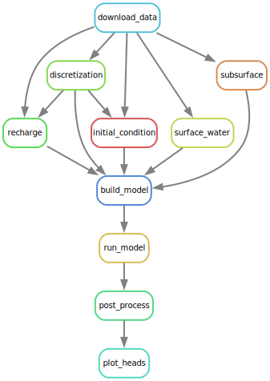

# Exercise 2: Creating a reproducible from scratch

This excercise is the second card of the reproducible modelling pizza course.
The first part of the course demonstrated how to work with an existing
reproducible model and [can be found
here](https://github.com/Deltares-research/FAIR-data-example-project).

In this second part of the course, we'll learn how to create a reproducible
workflow from scratch. 

## Requirements

We expect you to have installed:

- [pixi](https://pixi.sh/latest/)
- [git](https://git-scm.com/download/win)

# 1. Create directory

First create an empty folder somewhere on your machine. 

## TODO: Add requirements folder name

In general we advise to
do this outside the OneDrive folder, as that has the following downsides:
    
- The folder contains spaces (at least on Deltares laptops), this easily leads
  to mistakes as this often requires extra user input (e.g. put the path between
  quotes). Furthermore often software contains bugs or doesn't even support
  spaces in paths.
- A python installation will be created, which creates lots of files (>40k
  easily). This can easily clog your OneDrive synchroniztion
- It is not necessary, our project will be reproducible!

Open a powershell/cmd session and type:

```powershell
mkdir c:/users/<your_name>/<path>/<to>/<folder>
```

Next, navigate into the folder:

```powershell
cd c:/users/<your_name>/<path>/<to>/<folder>
```

# 2. Initialize project

## 2.1 Prepare python environment: Pixi

This workflow requires the following dependencies:

- [iMOD Python](https://deltares.github.io/imod-python/): Generate and
  process Modflow 6 models
- [DVC](https://dvc.org/): Data Version Control
- [cookiecutter](https://cookiecutter.readthedocs.io/en/stable/): Apply project templates
- [snakemake](https://snakemake.readthedocs.io/en/stable/): Workflow manager

First initialize pixi **in your project folder**. We require the use of two
channels. Most packages are located on ``conda-forge``, but Snakemake is only
published on ``bioconda``, therefore we specify this channel as well.

```powershell
pixi init --channel conda-forge --channel bioconda
```
Inspect your folder's contents in TotalCommander/Windows Explorer.
Alternatively, to inspect folder contents, you can print files and folders in
your shell session by calling in Powershell:

```powershell
dir
```

You can see the ``pixi init`` command created some text files, the important one
now being the ``pixi.toml`` file, which is a configuration file, containing all
the important settings to create a pixi python environment. We'll see how this
file gets extended later.

Next, add cookiecutter to your project dependencies:

```powershell
pixi add cookiecutter jinja2-time
```

> [!NOTE]
>
> At the time of writing (2024-03-06), cookiecutter didn't automatically install
> a dependency ``jinja2-time``. Therefore this package has to be added manually.

## TODO: Now check your toml file again

Inspect your folder again. Pixi created a hidden folder ``.pixi`` and a
``pixi.lock`` file, containing the python environment and text representation of
the exact state of the python environment contents. 

We'll add DVC. During the creation of this course, we found that dvc tended to
install an older version by default, therefore it is best to force installing
a later version:

```powershell
pixi add "dvc>=3.48.2"
```

Next, add iMOD Python. To save our iMOD developer colleagues some work for any
future breaking changes, we'll force you to install the latest version at time
of writing this material (2023-03-05).

```powershell
pixi add "imod=0.15.3"
```

Finally, add Snakemake. This will be installed from the bioconda channel.

```powershell
pixi add snakemake
```

Now activate your pixi environment in a shell session:

```powershell
pixi shell
```

## 2.2 Apply project template: Cookiecutter

### 2.2.1 Running cookiecutter

Next we'll apply the project template created by the Groundwater Management
Department, run:

```powershell
cookiecutter gl:deltares/imod/cookiecutter-reproducible-project
```

This will ask you to fill in some details about the project and consequently
creates a folder structure.

### 2.2.2 Moving pixi environment into project safely

We'll inspect the folder in detail soon, but first we have to deal with one
minor inconvenience, namely that it is the most convenient to have the pixi
files in the project root folder (i.e. one folder down). Therefore, move the
``pixi.toml`` and ``pixi.lock`` file to the project folder. You can do this
manually in your explorer, or do it from powershell:

```powershell
mv pixi.* <your_project_name>/
```

> [!NOTE]
>
> The asterisk (*) acts as a wildcard, so all files starting with "pixi." are
> matched (and moved), in this case ``pixi.lock`` and ``pixi.toml``.

Let's declutter some more by removing the pixi environment, we'll recreate it
later!

First exit your pixi session:

```powershell
exit
```

Then remove the ``.pixi`` folder:

```powershell
rm .pixi -Force -Recurse
```

> [!TIP]
>
> A python environment consists of a lot of files, easily over 40K, and easily
> becomes quite large, because of some common dependencies: most notorious is
> the ``mkl`` dependency. Therefore make sure to always permanently delete your
> ``.pixi`` environment, instead of it being moved to the Recylce Bin. In the
> Windows Explorer/Total Commander, this is done with shortcut key combination
> SHIFT+DELETE.

Move into your project folder:

```powershell
cd <your_project_name>
```

Before we continue to the next step, let's recreate our python environment
again:

```powershell
pixi install
```

Notice that it takes very little time for pixi to create your python environment
again! Now activate your pixi environment in a shell session:

```powershell
pixi shell
```

### 2.2.3 Project template folder structure

Inspect the folder again by calling:

```powershell
dir
```

You'll see the following structure (also conveniently described in the
``README.md``):

    .
    ├── AUTHORS.md
    ├── LICENSE
    ├── README.md
    ├── bin                 <- Your compiled model code can be stored here (not tracked by git)
    ├── config              <- Configuration files, e.g., for doxygen or for your model if needed
    ├── data                
    │   ├── 1-external      <- Data external to the project.
    │   ├── 2-interim       <- Intermediate data that has been altered.
    │   ├── 3-input         <- The processed data sets, ready for modeling.
    │   ├── 4-output        <- Data dump from the model.
    │   └── 5-visualization <- Post-processed data, ready for visualisation.
    ├── docs                <- Documentation, e.g., doxygen or scientific papers (not tracked by git)
    ├── notebooks           <- Jupyter notebooks
    ├── reports             <- For a manuscript source, e.g., LaTeX, Markdown, etc., or any project reports
    │   └── figures         <- Figures for the manuscript or reports
    └── src                 <- Source code for this project
        ├── 0-setup         <- Install necessary software, dependencies, pull other git projects, etc.
        ├── 1-prepare       <- Scripts and programs to process data, from 1-external to 2-interim.
        ├── 2-build         <- Scripts to create model specific inputm from 2-interim to 3-input. 
        ├── 3-model         <- Scripts to run model and convert or compress model results, from 3-input to 4-output.
        ├── 4-analyze       <- Scripts to post-process model results, from 4-output to 5-visualization.
        └── 5-visualize     <- Scripts for visualisation of your results, from 5-visualization to ./report/figures.

This project template is commonly applied in the unit Subsurface and Groundwater
Systems. It features a ``README.md`` already describing the folder structure,
which you can further extend with a project description. Furthermore, it features
an ``AUTHORS.md`` file where all contributors to the project are credited. Also there is a ``LICENSE`` file describing the license.

> [!WARNING]
>
> The license added is very permissive, which we find works fine for most
> projects. However, you might want to change it to a stricter license. For
> example, for secret projects you probably want to add a propietary license.

All data that you start your project with is stored in the
``data/1-external`` folder, these are usually the files you received from a
client, or downloaded somewhere. In case of model update, you could treat the
model before the update as "external data". This data is the starting point of
your workflow. Usually external data has to be reworked and cleaned up in order
to lead to meaningful results, this leads to pre-processed data is stored in
``data/2-interim``. Most model codes have their own specific files (often not
interoperable), these are stored ``data/3-input``. Model output data is stored
in ``data/4-output``. Finally, model output has to be post-processed for
plotting, this for example can be converting model-specific formats to more
interoperable file formats, converting a 3D grid to VTK blocks for 3D plotting,
or aggregating the data into a timeseries for a line plot. This data is stored
in ``data/5-visualization``. Figures created from this post-processed data are
stored in ``reports/figures``.

> [!TIP]
>
> Some model codes can only write model output in the input folder, in that case
> it is wise to add a script/command to move output files from ``data/3-input``
> to ``data/4-output``

# 3 Source version control: git

Version control means keeping track of all the changes made to the project. It
is an essential part of software engineering these days and is also very useful
in our project work! The most common software for version control these days is
[git](https://git-scm.com/download/win). This has the advantage that it is very
well tested, documented, and a wealth of useful tools are available. For
example, some IDE's (e.g. VSCode) have a built-in git integration, allowing you
to version control your scripts from there. We'll run you through the basics and
will only skim the surface. Git allows a lot more things, for example easy
collaboration on a code base with colleagues.

## 3.1 Initializing git

We'll start off by initializing a git repository:

```powershell
git init
```

This will create a hidden ``.git`` folder, which contains the full history of
your scripts. 

## 3.2 Committing the initial state

You now have an empty version control system. Time to add some files to it!
First, let's see what files git can add to its version control system.
Type:

```powershell
git status
```

This will show you an overview of what files/folders git can add:


To add all files, type:

```powershell
git add *
```

Check the status again:

```powershell
git status
```

This will show the files which are added:


Now comes the most confusing part when learning git: adding files doesn't mean
they are safely stored yet in the version control system. For that we have to
commit:

```powershell
git commit -m "My initial commit"
```

After committing, files are added to the version control system. The reason why
git does this in two steps is that it allows you to orchestrate your commits
into logical steps for the history. In this case this is unnecessary, as we are
committing everything in one go, but is very useful in more complex situations
(you have to trust the millions of users git has these days on that for now...)

Type ``git status`` again and it will show you there's nothing to commit. You
have now succesfully safely stored your text files! Any change you make to the
files checked into git can now be tracked and reverted back to an old state.

## 3.3 Modifying a file and committing changes

Let's modify a file and commit the changes. Open the ``README.md`` in your
favorite editor and change the description. If you don't have inspiration what
to write, you can write "Reproducible workflow to run a groundwater model for
the Drentse Hondsrug". Save the file, and type ``git status`` again to confirm
git noticed changes to the file.


Note that git also tips you with some commands you could use next: You can
either ``add`` the README to store changes, or ``restore`` it to its last
committed state.

Next, let's review the changes you made to the file exactly. Type:

```powershell
git diff
```

This will show you the changes you made to the text:


If you're satisfied with these changes, we can add them:

```powershell
git add README.md
```

and commit them: 

```powershell
git commit -m "Modify project description"
```

## 3.4 Checking version history

We can keep track of our version history by typing:

```powershell
git log
```

This will print you the two commits you made with their commit messages. Note
that it therefore is important to write short but descriptive commit messages,
so you can more easily retrace your steps! Commit messages like "Update" are too
generic to be of any use.

## 3.5 Excluding files from source version control

Note that your folder also contains a ``.gitignore`` file. This was included in
the cookiecutter project template. It can be opened and edited in any text
editor. Open it in your favorite text editor, and you will see certain folders
and file extensions being listed here. These files will be ignored by git, and
thus not kept in version control. This is useful: We do not want to version
control all our files in git, as bulky files can easily clog the version control
system, and don't have to be stored. We already added a bunch of common files
you are very likely not to want to add to your version control system in here.
For example, you do not want your ``.pixi`` folder, containing 2GB of python
installation specific to your machine, checked in git: the ``pixi.toml`` and
``pixi.lock`` file are enough to recreate the ``.pixi`` folder. Therefore the
``.pixi`` folder is included in the ``.gitignore`` file. In general, it is best
to not commit large files to git. Regular git also is not very useful to work
with binary data. In that case, you are better off using git-lfs or DVC. We'll
explain how to use DVC in a later stage of this exercise.

## 3.6 Adding scripts to repository

Finally, we'll add the Python scripts, which are our workflow steps. These are
already prepared in the folder [scripts](scripts). The scripts are named with a prefix
number indicating in which folder under ``src`` they are supposed to be put. For
example, ``0-download-data.py`` should be moved to the folder ``src/0-setup``.
Copy all scripts to their respective folder.

If everything went well ``git status`` will list the following files:


Add and commit these files the same way you did this before:

```powershell
git add *
git commit -m "Added scripts to repository"
```

## 3.7 Download Modflow 6 executable

Finally, in preparation of the next part of the exercise, we'll download the
Modflow 6 model code, [download the Modflow6 executable
here](https://github.com/MODFLOW-USGS/modflow6/releases/tag/6.4.2). If you are
working on Windows, the exe is included in the ``mf6.4.2_win64.zip``. Unpack the
zip somewhere, and copy ``mf6.4.2_win64/bin/mf6.exe`` to the project folder [you
created in the first section](#1-create-directory), under ``bin/mf6.exe``.

Verify that the ``.gitignore`` file is properly configured and thus ignores
``/<your_name>/<path>/<to>/<folder>/bin/mf6.exe``. Check that git doesn't list
it in a status check:

```powershell
git status
```


# 4 Setting up the workflow: Snakemake 

We have a collection of scripts, which are depending on each other. For example
``0-download-data.py`` should be called before calling ``1-surface-water.py``,
as downloaded data is required to schematize the surface water system. Snakemake
takes care of this. How it works is by checking for each step in the workflow
what data comes in and what data comes out. This has to be specified explicitly
by the user. For example, we have to tell snakemake that the file ``river.nc``
is output of the script ``0-download-data.py`` and input to the script
``1-surface-water.py``. Snakemake then will deduce by itsself that
``0-download-data.py`` has to be called before ``1-surface-water.py``. This
might seem underwhelming for such a trivial situation, but it gets very useful
in more complex situations, as snakemake deduces the dependence of steps and
order of computation by itsself.

## 4.1 Create a snakefile

To start configuring our snakemake workflow, start off by creating a file named
``snakefile``. By default, snakemake will look for a file named ``snakefile`` as
its configuration file. Snakemake defines its individual steps as "rules". Let's
add our first rule to the ``snakefile``. Open up your favorite editor, and copy
the following rule in your ``snakefile``:

```
rule download_data:
    output:
        path_layermodel = "data/1-external/layermodel.nc",
        path_starting_heads = "data/1-external/starting_heads.nc",
        path_meteorology = "data/1-external/meteorology.nc",
        path_drainage = "data/1-external/drainage.nc",
        path_river = "data/1-external/river.nc",
    script:
        "src/0-setup/0-download-data.py"
```

This rule will call the script ``src/0-setup/0-download-data.py`` and checks if
it produced the files: ``layermodel.nc``, ``starting_heads.nc``,
``meteorology.nc``, ``drainage.nc``, ``river.nc``.

Now run:

```powershell
snakemake -c1
```

This will run the snakemake workflow. The option ``-c1`` is shorthand for
``--cores 1`` and will thus tell snakemake to use only one core of your machine.
This is enough, as we have not defined any independent steps which can be run in
parallel.

## 4.2 Adding a second step

Let's define the second step to our workflow. We'll call the script
``src/1-prepare/1-discretization.py`` which creates the model's spatial
discretization for Modflow 6, based on hydrogeological layers provided in
``layermodel.nc``. We'll add the rule ``discretization`` above the
``download_data`` rule, as snakemake by default will look at the first rule to
run it (and all its dependencies.)

```
rule discretization:
    input:
        path_layermodel = "data/1-external/layermodel.nc",
    output:
        path_discretization = "data/2-interim/discretization.nc",
    script:
        "src/1-prepare/1-discretization.py"

rule download_data:
    output:
        path_layermodel = "data/1-external/layermodel.nc",
        path_starting_heads = "data/1-external/starting_heads.nc",
        path_meteorology = "data/1-external/meteorology.nc",
        path_drainage = "data/1-external/drainage.nc",
        path_river = "data/1-external/river.nc",
    script:
        "src/0-setup/0-download-data.py"
```

Run again in powershell:

```powershell
snakemake -c1
```

Depending on whether the output under ``download_data`` is already generated,
you'll see that Snakemake will run only the rule ``discretization`` or both. We
can demonstrate this behaviour by deleting the files
``data/1-external/layermodel.nc`` and ``data/2-interim/discretization.nc``, and
running Snakemake again:

```powershell
rm data/1-external/layermodel.nc
rm data/2-interim/discretization.nc
snakemake -c1
```

You'll see Snakemake runs the 2 jobs again. Snakemake automatically detects if
changes in data or scripts are made. There might be times, however, where you
want to force recomputation of all steps, for example because you think
Snakemake missed an important change to your workflow. Try running;

```powershell
snakemake -c1 --forceall
```


## 4.3 Finish your snakefile

<details>
  <summary> Let's complete the Snakefile: (<i>click to expand, it will show you the
  complete Snakefile</i>)</summary> <!-- have to be followed by an empty line!
  -->

```
rule plot_heads:
    input:
        path_head_nc = "data/5-visualization/groundwater_heads.nc"
    output:
        path_figure = "reports/figures/groundwater_heads.png"
    script:
        "src/5-visualize/5-plot.py"

rule post_process:
    input:
        path_hds = "data/4-output/GWF.hds",
        path_grb = "data/4-output/dis.dis.grb",
    output:
        path_head_nc = "data/5-visualization/groundwater_heads.nc"
    script:
        "src/4-analyze/4-post-process.py"

rule run_model:
    input:
        path_model = "data/3-input/mfsim.nam"
    output:
        path_hds = "data/4-output/GWF.hds",
        path_grb = "data/4-output/dis.dis.grb",
    shell:
        "cd data\\3-input && call ..\\..\\bin\\mf6.exe . && move GWF\\GWF.hds ..\\4-output\\GWF.hds && move GWF\\dis.dis.grb ..\\4-output\\dis.dis.grb"

rule build_model:
    input:
        path_discretization = "data/2-interim/discretization.nc",
        path_drn_pkg = "data/2-interim/drn_pkg.nc",
        path_riv_pkg = "data/2-interim/riv_pkg.nc",
        path_recharge =  "data/2-interim/recharge.nc",
        path_ic = "data/2-interim/ic.nc",
        path_chd = "data/2-interim/chd.nc",
        path_subsurface = "data/2-interim/subsurface.nc",
    output:
        path_model = "data/3-input/mfsim.nam"
    script:
        "src/2-build/2-build-model.py"

rule surface_water:
    input:
        path_drainage = "data/1-external/drainage.nc",
        path_river = "data/1-external/river.nc",
    output:
        path_drn_pkg = "data/2-interim/drn_pkg.nc",
        path_riv_pkg = "data/2-interim/riv_pkg.nc",
    script:
        "src/1-prepare/1-surface-water.py"

rule recharge:
    input:
        path_meteorology = "data/1-external/meteorology.nc",
        path_discretization = "data/2-interim/discretization.nc",
    output:
        path_recharge = "data/2-interim/recharge.nc",
    script:
        "src/1-prepare/1-recharge.py"

rule initial_condition:
    input:
        path_starting_heads = "data/1-external/starting_heads.nc",
        path_discretization = "data/2-interim/discretization.nc",
    output:
        path_ic = "data/2-interim/ic.nc",
        path_chd = "data/2-interim/chd.nc",
    script:
        "src/1-prepare/1-initial-condition.py"

rule subsurface:
    input:
        path_layermodel = "data/1-external/layermodel.nc",
    output:
        path_subsurface = "data/2-interim/subsurface.nc",
    script:
        "src/1-prepare/1-subsurface.py"

rule discretization:
    input:
        path_layermodel = "data/1-external/layermodel.nc",
    output:
        path_discretization = "data/2-interim/discretization.nc",
    script:
        "src/1-prepare/1-discretization.py"

rule download_data:
    output:
        path_layermodel = "data/1-external/layermodel.nc",
        path_starting_heads = "data/1-external/starting_heads.nc",
        path_meteorology = "data/1-external/meteorology.nc",
        path_drainage = "data/1-external/drainage.nc",
        path_river = "data/1-external/river.nc",
    script:
        "src/0-setup/0-download-data.py"

```

</details>

Oomph! That's a lot of steps! It's hard to quickly infer all data dependencies
just from looking at the Snakefile. First, because the author decided to put
things in unintuitive order. Second, the workflow is not a single pipeline, but
consists of several jobs which are partly independent of each other. Let's view
the graph of the workflow. 

To start off, make sure all rules are copied into the Snakefile. Next, run the
following command:

```powershell
snakemake --dag | dot -Tpdf -o dag.pdf
```

This will create a graph rendition of the workflow, which will look roughly as
follows:



Run the complete workflow:

```powershell
snakemake -c1
```

If everything went correct, the following plot is shown in
``reports/figures/groundwater_heads.png``:


## 4.4 Version control changes in git

Version control your changes in git:

```powershell
git add snakefile
git commit -m "Complete snakefile"
```

# 5 Data version control: DVC

So far, we've version controlled our scripts and configuration files (e.g.
``pixi.toml`` & ``snakefile``). These are text files, which can be version
controlled in Git. Git by default, however, deals poorly with binary data, such
as compiled executables, and large files. Therefore, we have to do separate data
version control. In this exercise, we'll apply DVC for this, as it is built on
top of git, and nicely separates data from text files. Our workflow currently
depends on the current binary files which are not version controlled:

1. The manually downloaded Modflow 6 executable
1. Downloaded NetCDF files in first script

The current state of the workflow might be already better than what you
encountered or produced yourself in most projects. However, it still faces the
following liabilities:

* Links on the internet to download data can break
* The data stored behind a link might change
* This is outside our control
* Colleagues have to put the downloaded executable in the right folder

Therefore we have to do better!

## 5.1 Initialize DVC

We first have to initialize our DVC repository:

```powershell
dvc init
```

This will add three files which are already automatically added to git, but not
yet committed (verify with ``git status``). Commit these:

```powershell
git commit -m "Initialize DVC"
```

## 5.2 Adding Modflow6 binary

Let's add our first file to DVC:

```powershell
dvc add bin/mf6.exe
```

This will print the following error message:

```
ERROR: bad DVC file name 'bin\mf6.exe.dvc' is git-ignored.
```

This is a clear error message: we have to modify the ``.gitignore`` file to stop
ignoring the ``bin/`` folder. As we now know what we are doing, we will not
casually check in binary files into git anymore, we can modify the
``.gitignore`` file. Open the ``.gitignore`` file and remove lines 94 and 95
from it and save. To be explicit, these lines can be removed:

```
...

# exclude compiled binaries
bin/

...
```

After you've removed these lines from the ``.gitignore`` file and saved, we'll first add version control these changes:

```
git add .gitignore
git commit -m "Stop ignoring bin folder"
```

Run ```dvc add bin/mf6.exe``` again. ``git status`` will print the following:

```
On branch main
Changes to be committed:
  (use "git restore --staged <file>..." to unstage)
        new file:   bin/.gitkeep
        new file:   bin/mf6.exe.dvc
```

What happened? DVC added a textfile ``bin/mf6.exe.dvc``. Open this file (but do
not modify!). The file contains a MD5 hash. In this case
``68ee4172873768963691d01d0e55ed80``. This is a unique code based on the data
itsself, which is used to check if any bit changed. Thus it is a quick way to
verify if two files, with different timestamps, are in fact the same. If you
want to know more about hashing, [some basics are outlined
here.](https://www.codecademy.com/resources/blog/what-is-hashing/)
Let's first commit our changes in git:

```powershell
git commit -m "Add exe to dvc"
```

Now look in the ``.dvc`` folder. A copy of the file is stored in
``.dvc/cache/files/md5/68/ee4172873768963691d01d0e55ed80``. This is how DVC
stores its different versions of data: 

1. A unique hash will be generated based on the data
1. The hash is stored in a ``.dvc`` text file
1. The file is copied into the ``cache``, but the filename is changed into the
   hash.

## TODO: Write something about data duplication

## 5.3 Adding external data

As outlined in the [introduction to this chapter](#5-data-version-control-dvc),
we want to add the data we downloaded into the ``data/1-external`` folder as
well.

First, in ``.gitignore``, modify the line ``data/1-external/`` into
``data/1-external/*.nc``. Thus we instruct git to only ignore files with the
``.nc`` extension. If you type:

```powershell
git diff
```

This should show you the following:

```
 # exclude data from source control by default
-data/1-external
+data/1-external/*.nc
 data/2-interim
 data/3-input
 data/4-output
```

We can consequently now add all files in 

```
dvc add --glob data/1-external/*.nc
```

> [!NOTE]
>
> The ``--glob`` option tells DVC to expand the wildcard ``*`` to match all
> files.

This will add all 6 netcdf files to DVC and create ``.dvc`` files.

Check in your files in git:

```powershell
git add data
git add .gitignore
git commit -m "Add external data to DVC"
```

## 5.4 Adding post-processed data

Most projects are a lot more complex than this example project and take a lot
more time to compute. It is therefore wise to also version control the
post-processed data in ``data/5-visualization``. Repeat the steps as in [the
previous subchapter](#54-adding-post-processed-data), but now for the
``data/5-visualization`` directory. This makes it easy to always retrace
previous outputs of the workflow that were checked in DVC.

# 6 Storing data externally

Congratulations, you have made your project entirely reproducible! However,
version control is only stored locally now, so a hardware crash will ruin your
project. Furthermore, it is impossible to collaborate with colleagues in this
state.

We therefore have to set up a remote and push our repositories to this. First,
we'll work on sharing our git repository online. Next, we'll share our data.

## 6.1 Where to share git repository?

There are multiple very nice tools existing to share and collaborate with git
repositories. The most commonly used these days being
[Github](https://github.com/). We are going to share our code for this exercise
on our personal Github accounts. You need to share your real projects in the
[Deltares-research Github group](https://github.com/Deltares-research), instead
of your personal account, because Deltares owns the rights to anything you
produce during your paid time. Note that everything shared here is shared on
external servers, outside the Deltares campus. Some projects have a clause that
no data should leave the Deltares campus. In that case, you should use [the
Deltares private Gitlab instance](https://git.deltares.nl). This information
might become outdated over time, therefore see the [Wiki page for the latest
information](https://publicwiki.deltares.nl/display/GIT/).

So in short:

- Projects that can be shared on [Deltares-research Github
group](https://github.com/Deltares-research)
- Projects that cannot, should be pushed to [the Deltares private Gitlab
instance](https://git.deltares.nl)

If you are unsure where to share your data, ask your project leader.

## 6.2 Sharing our git repository: Github

First, [sign up to Github if you haven't done
so](https://docs.github.com/en/get-started/start-your-journey/creating-an-account-on-github). 

Click on your user icon on the top right, and click "My repositories". This will
show you an overview of your personal repositories.


On the top, next to the search bar, click the blue "New" button:


In the presented form, think of a nice name for your repository, add a brief
description, and make sure **NO README, NO .gitignore and NO LICENSE** are
added. This will create an empty repository in Github, which makes our lives
significantly easier. Github will present us some commands to follow depending
on our situation. Our case fits *"…or push an existing repository from the
command line"*. Therefore run the following lines of code:

```powershell
git remote add origin https://github.com/<your_profile_name>/<your_repo_name_on_github>.git 
git branch -M main 
git push -u origin main
```

Now refresh your browser, and bask at your git repo in all its glory!
[It should look something like this.](https://github.com/JoerivanEngelen/fair-project-from-scratch-result)

## 6.3 Sharing data: DVC

DVC allows us to store and share data in dependent of Github. This is nice, as
Github has quite restricted total repository size, [Ideally 1 GB, 5 GB max, and
a per file limit of max 100
MB](https://stackoverflow.com/questions/38768454/repository-size-limits-for-github-com).
This is problematic for most of our projects. Therefore, DVC allows pushing your
data to different cloud providers (e.g. Amazon S3), self-hosted instances (SSH),
or network drives (our beloved P: drive). [See the list of supported storages
here](https://dvc.org/doc/user-guide/data-management/remote-storage#supported-storage-types).

Until we have something better (Deltares-hosted S3-compatible storage (MinIO) is
in the works, [see
wiki](https://publicwiki.deltares.nl/display/GIT/Github#Pages-Request).), the
easiest we can do for now is saving it to our N: drive postbox. This has the
advantage that this will be cleaned up later, so we also have to worry less
about cleaning up files after an exercise. For your projects, you should store
this data on the P: drive.

Let's add a remote for DVC:

```powershell
dvc remote add postbox "n:\Deltabox\Postbox\<yourname>\<your_remote_folder>"
```

Then consequently run:

```powershell
dvc push -r postbox
```

The location of the remote is stored in the ``.dvc/config`` file. We have to
make sure this is also committed to git and shared on Github:

```powershell
git add .dvc/config
git commit -m "Add dvc remote"
git push
```

Congratulations, your project is 100% reproducible now!
:sparkles: :100: :sparkles: